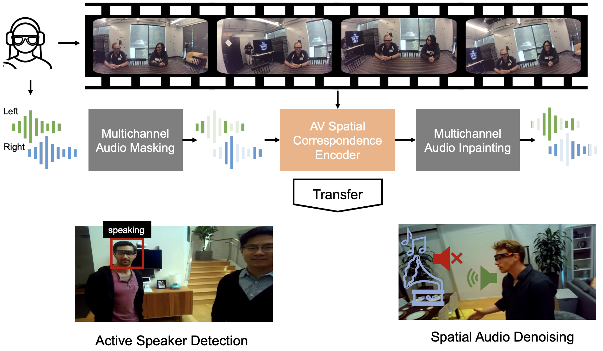

# [CVPR 24] Learning Spatial Features from Audio-Visual Correspondence in Egocentric Videos
This repository will very soon contain the PyTorch code for our **CVPR 2024 paper** and the associated datasets: 

[Learning Spatial Features from Audio-Visual Correspondence
in Egocentric Videos](https://vision.cs.utexas.edu/projects/ego_av_corr/)<br />
Sagnik Majumder, Ziad Al-Halah, Kristen Grauman<br />
The University of Texas at Austin, FAIR at Meta, University of Utah


Project website: [https://vision.cs.utexas.edu/projects/ego_av_corr](https://vision.cs.utexas.edu/projects/ego_av_corr)

<p align="center">
  
</p>

## Abstract
We propose a self-supervised method for learning representations based on spatial audio-visual correspondences in egocentric videos. Our method uses a masked auto-encoding framework to synthesize masked binaural (multi-channel) audio through the synergy of audio and vision, thereby learning useful spatial relationships between the two modalities. We use our pretrained features to tackle two downstream video tasks requiring spatial understanding in social scenarios: active speaker detection and spatial audio denoising. Through extensive experiments, we show that our features are generic enough to improve over multiple state-of-theart baselines on both tasks on two challenging egocentric video datasets that offer binaural audio, EgoCom and EasyCom.


## Code and Datasets
Coming soon!!


## Citation
```
@inproceedings{majumder2024learning,
  title={Learning spatial features from audio-visual correspondence in egocentric videos},
  author={Majumder, Sagnik and Al-Halah, Ziad and Grauman, Kristen},
  booktitle={Proceedings of the IEEE/CVF Conference on Computer Vision and Pattern Recognition},
  pages={27058--27068},
  year={2024}
}
```

# License
This project is released under the MIT license, as found in the LICENSE file.
